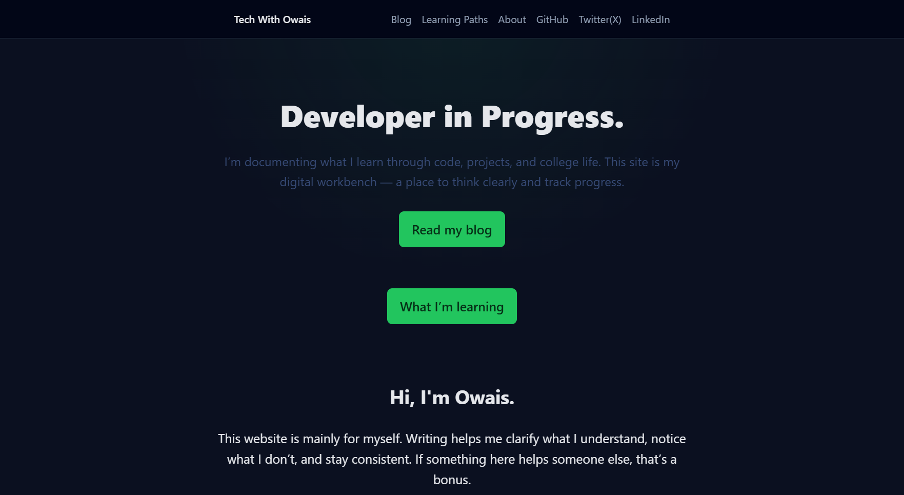

# TechWithOwais - My Personal Tech Blog

[](https://astro.build)

This is the source code for my personal tech blog, **TechWithOwais**. This blog is my digital space to document my journey as a computer science student—sharing projects, tutorials, and insights I gain along the way.

> **Check out the live site:** [**techwithowais.vercel.app**](https://techwithowais.co.in/)





---

## 🚀 Tech Stack

This project was built from the ground up using modern web technologies to be fast, secure, and developer-friendly.

-   **Framework:** [Astro](https://astro.build/) - For a super-fast, content-focused website.
-   **Content:** Written in Markdown (`.md`) and managed with Astro's Content Collections.
-   **Styling:** Plain CSS with variables for theming.
-   **Deployment:** Hosted on [Vercel](https://vercel.com/) via automated Git deployment.

---

## 🛠️ Running Locally

Want to run this project on your own machine? Follow these steps:

1.  **Clone the repository:**
    ```bash
    git clone [https://github.com/md-owais9956/TechWithOwais](https://github.com/md-owais9956/TechWithOwais)
    ```
    

2.  **Navigate into the project directory:**
    ```bash
    cd TechWithOwais
    ```

3.  **Install dependencies:**
    ```bash
    npm install
    ```

4.  **Start the local development server:**
    ```bash
    npm run dev
    ```

The site will now be available at `http://localhost:4321`.

---

## Acknowledgement

This project was bootstrapped using the official [Astro Blog Starter Template](https://astro.build/themes/details/blog/). A big thank you to the Astro team and its community for creating such an amazing tool.